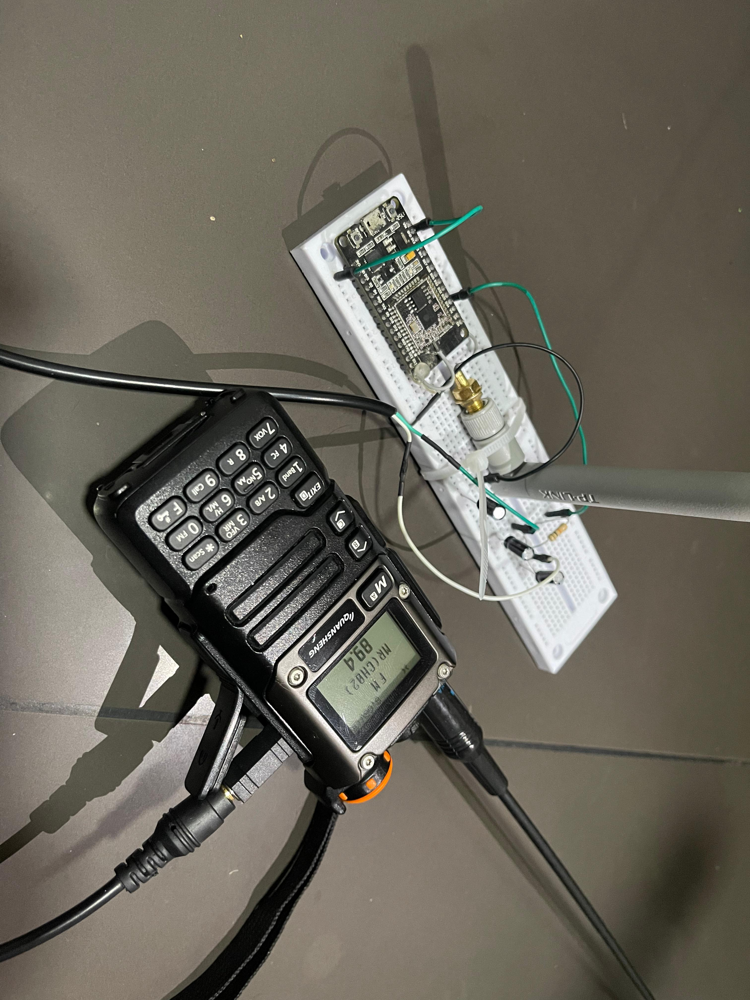
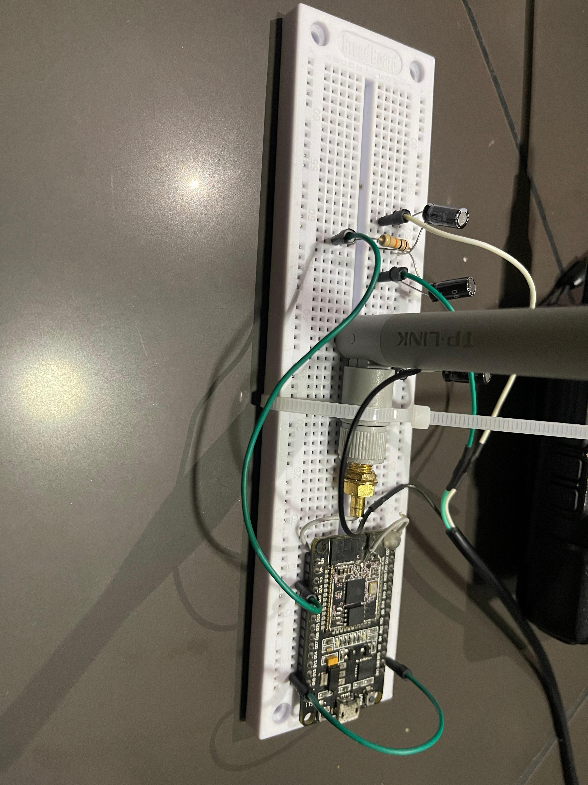

# udp-esp32-audio-transmiter-web-receiver
This project allows you to transmit audio through a jack connection to the esp32 to a website with flask. UDP packets are used to transmit the live audio signal to the local network.

